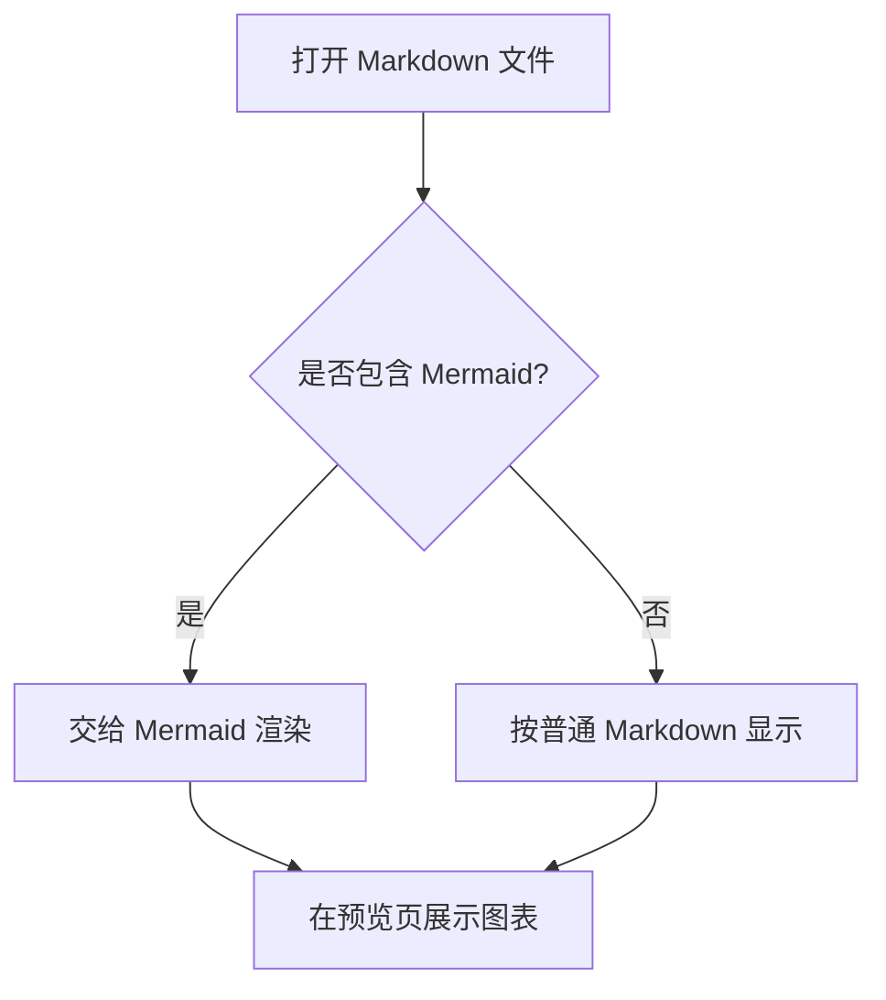
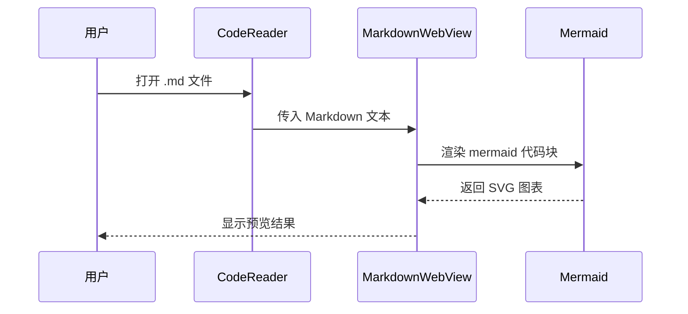
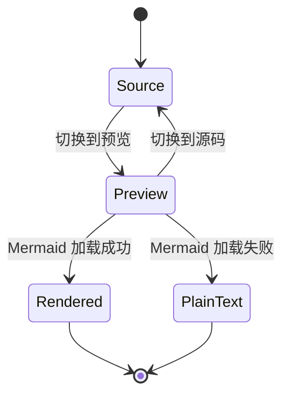

# Mermaid 渲染测试

下面这些代码块都使用 `mermaid` 语言标记。如果预览功能正常，它们会渲染成图表，而不是普通代码块。

## 流程图

```mermaid
flowchart TD
    A[打开 Markdown 文件] --> B{是否包含 Mermaid?}
    B -- 是 --> C[交给 Mermaid 渲染]
    B -- 否 --> D[按普通 Markdown 显示]
    C --> E[在预览页展示图表]
    D --> E
```

## 时序图

```mermaid
sequenceDiagram
    participant User as 用户
    participant App as CodeReader
    participant WebView as MarkdownWebView
    participant Mermaid as Mermaid

    User->>App: 打开 .md 文件
    App->>WebView: 传入 Markdown 文本
    WebView->>Mermaid: 渲染 mermaid 代码块
    Mermaid-->>WebView: 返回 SVG 图表
    WebView-->>User: 显示预览结果
```

## 状态图

```mermaid
stateDiagram-v2
    [*] --> Source
    Source --> Preview: 切换到预览
    Preview --> Source: 切换到源码
    Preview --> Rendered: Mermaid 加载成功
    Preview --> PlainText: Mermaid 加载失败
    Rendered --> [*]
    PlainText --> [*]
```

